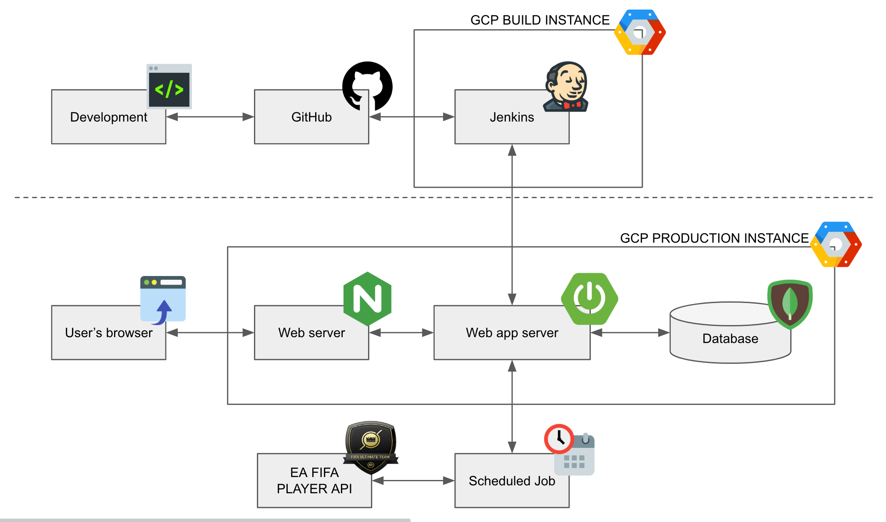

# FIFArm
FIFArm is a web site that search EA SPORTS FIFA ULTIMATE TEAM(FUT) players.

All FIFA assets are property of EA Sports.
```
  ______ _____ ______
 |  ____|_   _|  ____/\
 | |__    | | | |__ /  \   _ __ _ __ ___
 |  __|   | | |  __/ /\ \ | '__| '_ ` _ \
 | |     _| |_| | / ____ \| |  | | | | | |
 |_|    |_____|_|/_/    \_\_|  |_| |_| |_|
 SpringBoot - 2.1.7.RELEASE
```

## Architecture


## Built With
* [Maven](https://maven.apache.org/) - Dependency Management
* [JDK](http://www.oracle.com/technetwork/java/javase/downloads/jdk8-downloads-2133151.html) - Java™ Platform, Standard Edition Development Kit 
* [Spring Boot](https://spring.io/projects/spring-boot) - Framework to ease the bootstrapping and development of new Spring Applications
* [MongoDB](https://www.mongodb.com/) - Cross-platform document-oriented database program. Classified as a NoSQL database program, MongoDB uses JSON-like documents with schema.
* [git](https://git-scm.com/) - Free and Open-Source distributed version control system 
* [Thymeleaf](https://www.thymeleaf.org/) - Modern server-side Java template engine for both web and standalone environments.

## External Tools Used
* [Jenkins](https://jenkins.io/) - Open source automation server which enables developers around the world to reliably build, test, and deploy their software.
* [Postman](https://www.postman.com/) - API Development Environment (Testing Docmentation)

## APIs
|  URL |  Method | Remarks |
|----------|--------------|--------------|
|`/api/search/{name}` | GET | Search Players By Name |
|`/api/player/{id}` | GET | Search Player By ID |
|`/api/autocomplete?term={keywords}` | GET | Autocomplete according to keywords |

## Structure
```
.
├── src
│   └── main
│       └── java
│           ├── net.fifarm.spider
│           ├── net.fifarm.spider.config
│           ├── net.fifarm.spider.controller
│           ├── net.fifarm.spider.cv
│           ├── net.fifarm.spider.job.schedule
│           ├── net.fifarm.spider.net
│           ├── net.fifarm.spider.service
│           └── net.fifarm.spider.util
├── src
│   └── main
│       └── resources
│           └── static
│           │   ├── css
│           │   ├── error
│           │   └── images
│           ├── templates
│           │   ├── fragments
│           │   └── layout
│           ├── test
│           │   └── json
│           ├── application.yml
│           ├── banner.txt
│           └── logback.xml
├── src
│   └── test
│       └── java
│           ├── net.fifarm.spider
│           ├── net.fifarm.spider.controller
│           ├── net.fifarm.spider.db
│           ├── net.fifarm.spider.json
│           ├── net.fifarm.spider.log
│           ├── net.fifarm.spider.service
│           └── net.fifarm.spider.util
├── .gitignore
├── mvnw
├── mvnw.cmd
├── pom.xml
└── README.md
```

## Packages
- `config` — to config application.
- `controller` — to listen to the client.
- `cv` — to use static String values.
- `job/schedule` — to set scheduled job that get players json from EA FUT API.
- `net` — to request url.
- `service` — to hold our business logic.
- `util` — to gather frequent codes.

- `resources/` - contains all the static resources, templates and property files.
- `resources/static` - contains static resources such as css, js and images.
- `resources/templates` - contains server-side templates which are rendered by Spring Boot.
- `resources/application.yml` - contains application-wide properties. Spring Boot reads the properties defined in this file to configure this application.

- `test/` - contains unit and integration tests.

- `pom.xml` - contains all the project dependencies.

## License
[CC BY-NC-ND 4.0](https://creativecommons.org/licenses/by-nc-nd/4.0/)