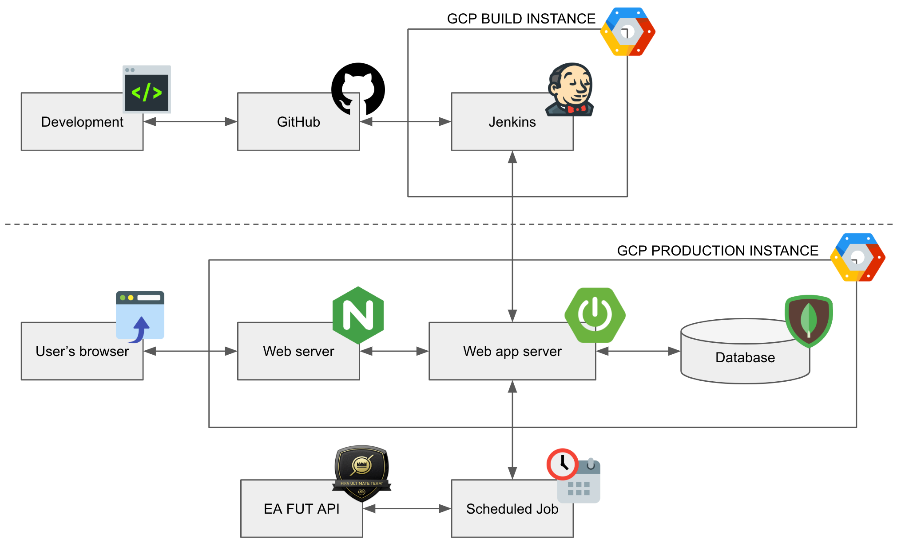

# FIFArm
EA SPORTS FIFA ULTIMATE TEAM DATABASE
```
  ______ _____ ______
 |  ____|_   _|  ____/\
 | |__    | | | |__ /  \   _ __ _ __ ___
 |  __|   | | |  __/ /\ \ | '__| '_ ` _ \
 | |     _| |_| | / ____ \| |  | | | | | |
 |_|    |_____|_|/_/    \_\_|  |_| |_| |_|
 SpringBoot - 2.1.7.RELEASE
```

## Architecture


## Structure
```
fifarm
├── src
│   └── main
│       └── java
│           ├── net.fifarm.spider
│           ├── net.fifarm.spider.config
│           ├── net.fifarm.spider.controller
│           ├── net.fifarm.spider.cv
│           ├── net.fifarm.spider.job.schedule
│           ├── net.fifarm.spider.net
│           ├── net.fifarm.spider.service
│           └── net.fifarm.spider.util
├── src
│   └── main
│       └── resources
│           └── static
│           │   ├── css
│           │   │   └── common.css
│           │   ├── error
│           │   │   ├── 5xx.html
│           │   │   └── 404.html
│           │   ├── images
│           │   │   └── ajax-loader.gif
│           │   ├── js
│           │   ├── favicon.ico
│           ├── templates
│           │   ├── fragments
│           │   │   ├── common.html
│           │   │   ├── config.html
│           │   │   ├── footer.html
│           │   │   ├── header.html
│           │   ├── layout
│           │   │   └── default.html
│           │   ├── index.html
│           │   ├── player.html
│           │   └── playerList.html
│           ├── application.yml
│           ├── banner.txt
│           └── logback.xml
├── src
│   └── test
│       └── java
│           ├── net.fifarm.spider
│           ├── net.fifarm.spider.db
│           ├── net.fifarm.spider.json
│           ├── net.fifarm.spider.log
│           ├── net.fifarm.spider.simple
│           └── net.fifarm.spider.util
├── .gitignore
├── mvnw
├── mvnw.cmd
├── pom.xml
└── README.md
```
